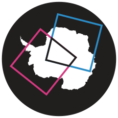

# `matchmakeo`

<p align="center">
    
</p>


[](https://github.com/bas-quasar/matchmakeo)
[](https://bas-quasar.github.io/matchmakeo)

[](https://github.com/bas-quasar/matchmakeo/actions/workflows/test.yml)


**Alpha** - this project is in the early stages of development and should be considered unstable.

`matchmakeo` (*match-make-EE-OH*, [*mæʧ meɪk ee əʊ*]) is a python package to help with finding related earth observation data from two or more different sources. For example, if you wanted to find images from Sentinel-1 and MODIS of overlapping locations that were taken within 1 hour of each other.

The package provides a high-level interface to a number of technologies that enable sophisticated and efficient analysis of earth observation image metadata, namely: API queries to public metadata catalogues; and geospatial databases for performing queries across multiple data products from different sources.

## Get started

## Install `matchmakeo`

To install directly from GitHub with `pip`:

`pip install git+https://github.com/bas-quasar/matchmakeo.git`

Or from a locally cloned copy of the repo:

```sh
git clone git@github.com/bas-quasar/matchmakeo.git`
pip install -e ./matchmakeo
```

### Database requirements
`matchmakeo` works using a geospatial database, this can either be a one-off local database or a remote database provided you can connect to it and have permissions to create tables. Databases can either be PostgreSQL with the PostGIS extension, or SQLite with the Libspatialite extension.

For a basic example and for most use cases, we recommend using [docker](https://www.docker.com/get-started/) to spin up a local container with a [PostGIS image](https://hub.docker.com/r/postgis/postgis), this oneliner should do it:

```sh
docker run \
    --name matchmakeo-db \
    --volume ./data/db:/var/lib/postgresql/data \
    -p 5432:5432 \
    -e POSTGRES_DB=matchmakeo \
    -e POSTGRES_PASSWORD=password \
    -d --rm postgis/postgis
```

This will launch a postgis container named `matchmakeo-db` with a database named `matchmakeo` using the default username `postgres`, with data stored at local disk location `./data/db` - run `mkdir -p ./data/db` if you don't already have this location.


## Basic Usage

### Download a set of footprint metadata to your database

For example, for MODIS:

```python
from matchmakeo.catalogues import NasaCMR
from matchmakeo.databases import PostGISDatabase
from matchmakeo.download_params import NasaCMRDownloadParams
from matchmakeo import Product, Query

# define your database object with the connection details
database = PostGISDatabase(
    username="postgres",
    password="password",
    database="matchmakeo",
    host="localhost",
    port=5432,
)

# make an instance of the catalogue object corresponding to which catalogue you want to download from
catalogue = NasaCMR(
    client_id="my_name",  # NasaCMR takes a client_id as recommended by CMR
)

# define a download_params obect to filter the temporal and spatial bounds of your download
# some catalogues have a corresponding download_params type, others just use the base DownloadParams
download_params = NasaCMRDownloadParams(
    start_date="2020-01-01",
    end_date="2020-01-31",
    lat_max=-70,
    lat_min=-90,
    lon_max=180,
    lon_min=-180,
)

# define a product object corresponding to the data product you want to download
# the name argument defines which product is downloaded
# table_name defines the name of the database table that these downloads are inserted into
product = Product(
    name="MOD021KM",  # product name to download
    table_name="modis_aqua",  # table name to insert these into in your database
)

# run the download, passing in the product, download_params and database objects as arguments
catalogue.download_footprints(
    product=product,
    download_params=download_params,
    database=database,
    # optionally set dry run to be True, each catalogue behaves differently but nothing will be inserted into the database if so
    # when dry_run=True database can be None, so you can run without a database set up
    # dry_run=True,
)

# run a basic query against this single product (for more sophisticated queries, see the docs!)
results = (
    Query(database, product_a)
    .within_bbox(xmin=0.0, ymin=52.1, xmax=0.2, ymax=52.2, product=product_a, srid=4326)
    .execute()
)

# show the ids of the images that match the query
print(results.get_ids())
```
