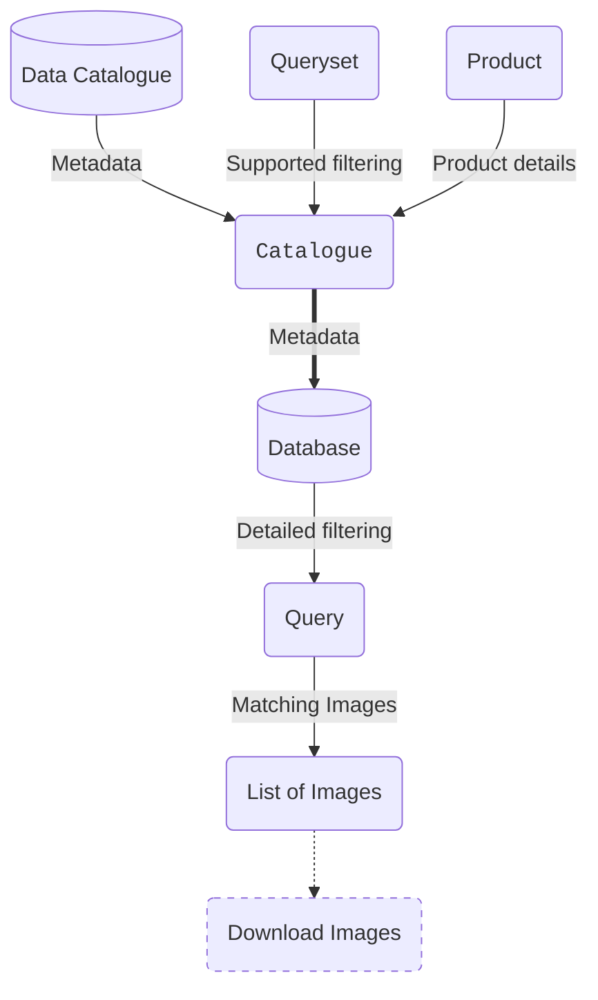

# Getting Started

`matchmakeo` is designed to provide a high-level interface for researchers to obtain, manage and analyse earth observation image metadata, easing the need to write your own API queries or manage databases, whilst still allowing you to work in this way if you choose.

It provides hopefully intuitive and concise interfaces with metadata catalogues and databases through python scripting, enabling you to focus on your research questions.

## Concepts

Much of the terminology is heterogeneous across different data sources and we need to represent those concepts within `matchmakeo`'s interface, here we attempt to clarify.

### Metadata

`matchmakeo` handles earth observation image *metadata*, not the image data itself. Metadata includes the geometry/footprint/outline of the image as well as any other properties of the image such as its acquisition time, whether it was night or day, the mode of the instrument, the orbit, *etc. etc.*

Once the metadata has been analysed and compared, `matchmakeo` can give a list of which images themselves match your criteria, which can then be downloaded and processed by other tools (watch this space...)

### Footprints

The geometry (often a polygon) representing the outline of the image.

### Catalogues

Images and metadata are made available through a number of platforms, which in `matchmakeo` we call "catalogues". These are the services from which metadata is obtained. Built-in catalogue interfaces are:

+ [NASA Common Metadata Repository](https://www.earthdata.nasa.gov/about/esdis/eosdis/cmr){target="_blank"}
+ [Google EarthEngine](https://earthengine.google.com/){target="_blank"}
+ [JAXA G-Portal](https://gportal.jaxa.jp/gpr/){target="_blank"}

You can also implement your own interface to another catalogue by inheriting from `matchmakeo.catalogues.Catalogue` - more documentation to follow. Or [open an issue on GitHub](https://github.com/bas-quasar/matchmakeo/issues/new){target="_blank"} to request another catalogue interface.

### Products

Different data products are made available through the catalogues, which may have varying levels of processing. It's up to you to know which product you need to analyse from which catalogue.

### Downloading footprints

`matchmakeo` works by downloading some of the metadata and inserting it into a database. To save disk space and download time it pays to download as narrow a range of the metadata of interest as possible. `matchmakeo` ultimately aims to use as many filtering options as each catalogue interface allows, then use queries on the data in the database to further narrow down the images of interest before you then download the images themselves, saving you time, energy and disk space.

### Databases

Using databases to store and query the metadata is far more efficient than storing them as files or reading them into memory to compare them.

If you don't have experience of working with databases, don't worry! `matchmakeo` aims to abstract away the complications of interacting with databases as much as possible.

`matchmakeo` supports two types of geospatial database: PostGIS and spatialite.

For help setting up a database, see the [databases page](databases.md).

### Querying

_In progress..._

## Workflow

